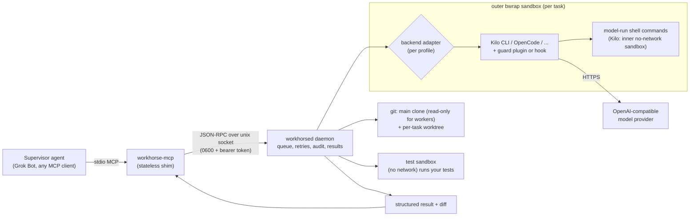

# Grok Workhorse

[](https://github.com/mrchatam/Grok-workhorse/actions/workflows/ci.yml)

> Unofficial community project. Not affiliated with, endorsed by or sponsored by xAI.

**Grok Workhorse lets a supervising AI agent (for example Grok Bot) hand coding tasks to sandboxed
coding-agent workers on your own Linux machine.** The supervisor calls a small MCP interface
(`delegate_task`, `wait_task`, `task_result`, ...). A local daemon creates a fresh git worktree for
each task and runs a coding-agent CLI (Kilo CLI or OpenCode today, with more adapters on the way)
inside a bubblewrap sandbox, using any OpenAI-compatible model you configure. The daemon then runs your
tests itself and returns a short structured result plus the diff. Workers never commit, merge or push:
you (or your supervisor) review the branch and decide.

- Repo: https://github.com/mrchatam/Grok-workhorse
- License: MIT (vendored skills: MIT, see [NOTICE](NOTICE))
- Status: v0.3.0 in development (latest release v0.1.0), Linux only

**Why:** to reduce supervisor (for example Grok) usage. The expensive model plans and reviews; smaller
models you choose do the bounded coding work, and v0.3 keeps what the supervisor reads and does per task
small (one `wait_task` call, a ~0.5-1 KB brief result, automatic fix rounds and reviews on cheap
models). See [docs/token-savings.md](docs/token-savings.md).

## Features

- **MCP server over stdio**, usable from any MCP client (Grok Bot custom connector, Claude Desktop, Cursor, ...). It forwards to one persistent daemon, so many supervisor sessions share a queue.
- **Pluggable worker backends.** One adapter interface drives different coding-agent CLIs, and each profile picks its backend ([adapter matrix](#adapter-matrix)).
- **Any OpenAI-compatible provider**: NVIDIA NIM, OpenRouter, vLLM, LiteLLM, Together, Groq, a local Ollama, and so on. Profiles have ordered fallback chains for 429/5xx errors, with retries and back-off.
- **Isolation per task**: its own git worktree and branch (`workhorse/<task_id>`), its own agent session data, and an outer bwrap sandbox that hides everything else. Tests run in a second sandbox with no network.
- **Defense in depth**: a repo allowlist, a test-command allowlist (anchored regexes), an allowlist of clone hosts, a guard plugin/hook for git mutation, network clients and secret access, a read-only git object store, and root-owned config.
- **Structured results**: verdict (`success`, `tests_failed`, `no_changes`, `blocked`, `integrity_violation`, ...), diffstat, daemon-run test results, the worker's self-report, concerns, token usage and timings. Raw logs are paged on demand.
- **Follow-ups and reviews**: `continue_task` resumes the same session and worktree. `mode: "review"` runs a read-only reviewer on another task's diff.
- **Handoff records and human approval**: every finished task says who acts next (`owner`), the one exact `next_action`, which checks failed, and how to resume. A worker that needs a human decision parks the task as `needs_approval` (worktree kept) until someone answers with `approve_task`. Supervisors record their own handoffs with `update_handoff`. See [docs/handoff.md](docs/handoff.md).
- **Token savings (v0.3)**: `wait_task` long-poll (one call instead of a polling loop), compact JSON
  and a `brief` result view, `delegate_tasks` batches, presets and size routing, automatic fix rounds and
  cheap-to-strong escalation with hard caps, an optional cheap advisory review, `usage_report` /
  `workhorse stats` with a labelled estimate of supervisor tokens avoided, and opt-in worker savers
  (terse output, minimal-code bias, RTK for shell output). See [docs/token-savings.md](docs/token-savings.md).
- **Operator-confirmed approvals** (optional): with `approvals.require_operator`, the supervisor's
  approval only records a request and a human confirms that exact request on the host with a separate
  operator token. It gates the parked-task flow; it is not a capability boundary (see
  [docs/handoff.md](docs/handoff.md#operator-confirmation-approvalsrequire_operator-v03)).
- **Operations**: stall detection (15 min by default, per profile with `stall_minutes`), wall-clock timeouts, cancel, recovery after a daemon restart, retention sweeps, an append-only JSONL audit log (rotated by size), and `workhorse health` for daily checks.
- **Credentials from the environment first** (daemon env, or the MCP connector env passed through the shim), with an optional secret-store fallback. Keys never appear in argv, logs or results.

## Measured savings

All figures below are **estimates** from small samples on this repository; details, method and caveats
are in [docs/token-savings.md](docs/token-savings.md#benchmarks).

| What | Estimate | How it was measured |
|---|---|---|
| Supervisor tokens read per task, succeeds first time (v0.2 polling flow vs v0.3 `wait_task` + brief) | ~3,060 -> ~360 (about -88%) | test-only stub backend on the calc fixture; responses counted with the `o200k_base` tokenizer as a proxy; assumes 5 status polls in the v0.2 flow |
| Same, tests fail once then fixed (v0.2 manual `continue_task` vs v0.3 `auto_fix_rounds: 1`) | ~6,900 -> ~400 (about -94%) | same method; the fix round costs worker tokens on the cheap profile instead |
| RTK on worker shell output (8 common commands) | about -35% overall (0% to -76% per command) | RTK v0.50.0 on this repository, `o200k_base` token counts of each command's output before/after the rewrite |
| Worker output with `terse` + `minimal_code` (`lite`) | about -10% output tokens | 3 A/B pairs on one real model through Kilo, provider-reported tokens; not statistically meaningful |

`workhorse stats` / `usage_report` give a conservative running ESTIMATE for your own tasks (formula in
the same doc).

## Architecture



More detail: [docs/architecture.md](docs/architecture.md). Handoff records and the approval flow: [docs/handoff.md](docs/handoff.md).

## Security model (short version)

Workers are treated as untrusted code. Inside the outer sandbox, a worker sees the toolchain
(read-only), its own worktree (read-write), the repo's git object store (read-only), and its backend's
HOME, config and per-task data. Everything else is replaced by empty tmpfs mounts or hidden: the data
dir, other tasks, the daemon socket and token, the secret store, the main clone, the rest of `/home`,
`/tmp` and `/run`. Guard plugins/hooks add pattern-level checks on top. The daemon, not the worker, runs
the tests and computes the verdict, and it flags commits or changes to the main clone as integrity
violations.

Known limits, stated plainly:

- The agent process itself needs network access to reach the model API. Kilo denies network to
  model-run shell commands with its inner sandbox. OpenCode has no inner sandbox, so its commands keep
  network access, and the guard blocks common network clients by name only.
- The provider API key is in the agent process's environment. Kilo/OpenCode blank it in model-run
  shells through the guard plugin. The Claude Code adapter (untested) cannot fully hide it from Bash.
- Pattern guards are a second layer, not a boundary. The sandbox is the boundary.

Full threat model: [docs/security.md](docs/security.md). To report a vulnerability, see
[SECURITY.md](SECURITY.md).

## Quick start

Requirements: Linux with unprivileged user namespaces (bubblewrap), Node.js >= 22, git, and sudo for the
install step. Python 3 is needed only for the full test suite.

```bash
git clone https://github.com/mrchatam/Grok-workhorse.git grok-workhorse
cd grok-workhorse
# Optional: make the provider key available to the self-test (it is passed through the environment only)
export NVIDIA_API_KEY=...            # or OPENROUTER_API_KEY with --provider openrouter
sudo --preserve-env=NVIDIA_API_KEY bash scripts/install.sh --provider nvidia
```

The installer is idempotent, so you can re-run it to upgrade. It copies the app to `/opt/grok-workhorse`
(root-owned), pins the Kilo CLI, checks bubblewrap, writes and locks the config, creates a hello-world
repo, installs the `workhorse` and `workhorse-mcp` commands, runs the tests, and finishes with a live
hello task if the key is available. Useful options: `--with-opencode`, `--systemd`,
`--secret-store PATH`, `--prefix`, `--data-dir`, `--full-tests`, `--token-savers LIST` / `--rtk-bin PATH` (opt-in worker token savers). Run `bash scripts/install.sh --help`
for the full list.

Then:

```bash
workhorse health                   # everything ok?
workhorse hello                    # end-to-end smoke task on the default profile
sudo workhorse add-repo https://github.com/you/your-repo.git --test "npm test"
```

Register the MCP server in your client as a **stdio** server:

```json
{ "command": "/usr/local/bin/workhorse-mcp", "args": [], "env": { "NVIDIA_API_KEY": "<secret reference>" } }
```

To uninstall, run `sudo bash /opt/grok-workhorse/scripts/uninstall.sh`. Add `--purge-data` to also
delete clones, worktrees and history.

## Configuration

Config lives in `<prefix>/config/` and is root-owned once locked. To edit it, run
`sudo bash <prefix>/scripts/unlock-config.sh`, edit the files, run `workhorse validate`, then run
`sudo bash <prefix>/scripts/lock-config.sh`.

| File | What it holds |
|---|---|
| `profiles.json` | providers (OpenAI-compatible `base_url` plus the *name* of the env var holding the key), models, profiles (`backend`, `model`, `fallback` list, `escalate_to`, `stall_minutes`, `token_savers`), `default_profile`, `presets`, size `routing`, `auto` follow-ups |
| `repos.json` | repo allowlist: local `path` or clone `url`, default branch, default/allowed test commands, `test_network`, `trust_project_config` |
| `daemon.json` | concurrency, timeouts (stall 15 min), retries, retention, backends (`bin`, pinned version), sandbox binds/env, `secret_store_path`, allowed clone hosts, `token_savers`, `approvals`, `audit` rotation, `supervisor` estimate inputs |

A profile that runs Kilo on NVIDIA and falls back to OpenCode on OpenRouter:

```json
{
  "default_profile": "default",
  "profiles": {
    "default":  { "backend": "kilo",     "model": "nvidia/nemotron-ultra", "fallback": ["backup"] },
    "backup":   { "backend": "opencode", "model": "openrouter/qwen-coder" }
  },
  "providers": {
    "nvidia":     { "base_url": "https://integrate.api.nvidia.com/v1", "api_key_env": "NVIDIA_API_KEY",
                    "models": { "nemotron-ultra": { "id": "nvidia/nemotron-3-ultra-550b-a55b", "reasoning": true } } },
    "openrouter": { "base_url": "https://openrouter.ai/api/v1", "api_key_env": "OPENROUTER_API_KEY",
                    "models": { "qwen-coder": { "id": "qwen/qwen3-coder" } } }
  }
}
```

The complete reference is in [docs/configuration.md](docs/configuration.md). Ready-made examples are in
[config/examples/](config/examples/); `profiles.tiered.json` shows a cheap -> mid -> strong setup with
presets, size routing and automatic follow-ups.

**Credentials.** The daemon looks up each provider's `api_key_env` in this order: its own environment,
the env the MCP shim was started with (offered to the daemon in memory only), and finally the optional
`secret_store_path` JSON file. Missing keys make a task fail fast with a clear message, and
`workhorse check-provider` sends one tool-calling request per profile to test a key and model.

## Adapter matrix

| Backend | CLI | Status | Guard | Inner shell sandbox | Resume | Notes |
|---|---|---|---|---|---|---|
| `kilo` | [Kilo CLI](https://kilo.ai) 7.8.1 | **tested** (full mock suite + live) | plugin | yes (bwrap, no network) | yes | default |
| `opencode` | [OpenCode](https://opencode.ai) 1.18.32 | **tested** (full mock suite + live) | same plugin | no (commands keep network) | yes | `--with-opencode` |
| `claude-code` | Claude Code (`claude -p`) | untested | PreToolUse hook (unit-tested) | Claude's sandbox setting | yes | needs `kind: "anthropic"` provider |
| `codex` | OpenAI Codex CLI (`codex exec`) | untested | none (Codex sandbox) | yes (Codex workspace-write) | yes | |
| `gemini` | Gemini CLI | skeleton (TODO) | | | | |
| `aider` | Aider | skeleton (TODO) | | | | |

"Tested" means the backend passes the full integration suite against a scripted mock LLM (worktrees,
sandbox escapes, guard, credentials, continue/review, retries and fallback, cancel/stall/timeout,
recovery, MCP). "Untested" adapters are implemented from the CLIs' documentation and covered by unit
tests only. See [docs/adapters.md](docs/adapters.md) for the adapter interface and how to add one.

## Grok Bot template

[`grok-template/`](grok-template/) holds two draft Grok Bot skills:

- **getting-started**: walks a new user through choosing a provider and model, adding repos, storing
  the key securely, running the installer, registering the stdio connector and running the first task.
- **delegation**: how a supervisor should delegate cheaply. It reads `list_models` and `list_repos`,
  picks a preset or size, writes self-contained task descriptions, waits with `wait_task`, reviews the
  brief result (and the diff when needed), follows `next` / `handoff.next_action`, uses automatic fix
  rounds or `continue_task` for fixes, relays approvals, and merges or cleans up.

Copy them into your Grok Bot skills if you want them. Nothing in this repo installs them automatically.

## Operator CLI

```
workhorse start|stop|restart|status     supervisor + daemon (runs as the service user)
workhorse health [--json]               full check (exit 1 on FAIL), good for a daily cron
workhorse backends                      adapters: status, installed, capabilities
workhorse tasks | logs | audit          recent tasks, daemon log, audit log
workhorse attention                     tasks that need someone (parked or handoff not done)
workhorse handoff <id> [--owner O --next "..." --note "..." --state S]   show or update a handoff
workhorse approve <id> | reject <id>    answer a parked (needs_approval) task (sends the operator token if required)
workhorse wait <id>... [--all] [--max S] [--full]   long-poll until tasks finish or park
workhorse stats [--days N] [--profile P] [--json]   worker usage by profile/day + supervisor ESTIMATE
workhorse token-savers [...] | off      show or set opt-in worker token savers
workhorse operator-token init [--enable]   create the operator token for require_operator
workhorse cleanup-old [--days N]        retention sweep now
workhorse repos | add-repo | remove-repo | validate | check-provider | hello
```

## Development

```bash
npm run setup          # npm ci for the app and the backend config dirs
npm run test:unit      # fast, no CLI or network needed (runs in CI)
npm run test:stub      # end-to-end flows with the test-only stub backend: git + python3 only (runs in CI)
npm test               # full suite: needs the Kilo CLI, bwrap, git, python3 (mock LLM), ~10 min
WH_TEST_BACKEND=opencode WH_OPENCODE_BIN=$(command -v opencode) npm test   # same suite on OpenCode
WH_LIVE_TEST=1 NVIDIA_API_KEY=... npm run test:live                        # one real task
```

See [CONTRIBUTING.md](CONTRIBUTING.md). Troubleshooting (AppArmor user namespaces on Ubuntu 24.04+,
toolchain caches, stalls) is in [docs/troubleshooting.md](docs/troubleshooting.md).

## FAQ

**Is this an official xAI or Grok product?** No. It is an independent community project that works
well with Grok Bot's custom MCP connectors and with any other MCP client.

**Does it need Grok?** No. Any MCP client can be the supervisor, and workers can use any
OpenAI-compatible model.

**Why not run the coding agent directly?** You could. Workhorse adds what unattended delegation needs:
isolation per task, allowlists, tests run by the daemon rather than self-reported, a verdict you can
trust, a queue with retries and fallback, and an audit trail.

**Can a worker push to my repo?** It has no credentials, git metadata is read-only inside its sandbox,
and the guard refuses git mutation. The daemon flags any commit as an `integrity_violation`. Integration
is always your step.

**Does it work on macOS or Windows?** Not yet. The sandbox relies on Linux user namespaces
(bubblewrap). WSL2 may work but is untested.

**Docker?** Not needed. Nested bwrap inside an unprivileged container usually fails, so run it on a VM
or host.

**Which model should I use?** One with reliable tool calling and a large context. Run
`workhorse check-provider` to confirm that tool calls work before relying on a model.

## Acknowledgements

The worker skills in `adapters/kilo/config/skills/` are vendored (unmodified, some files removed) from
[obra/superpowers](https://github.com/obra/superpowers) (MIT, Jesse Vincent). Kilo CLI and OpenCode are
projects of their respective authors. The `terse` and `minimal_code` token-saver fragments are our own
wording, inspired by Caveman and Ponytail (both MIT); the optional RTK integration calls the separately
installed RTK binary (Apache-2.0). See [NOTICE](NOTICE).

[](https://m8ven.ai/mcp/mrchatam-grok-workhorse-1ma7qr?s=readme)

[](https://m8ven.ai/mcp/mrchatam/grok-workhorse?s=readme)
