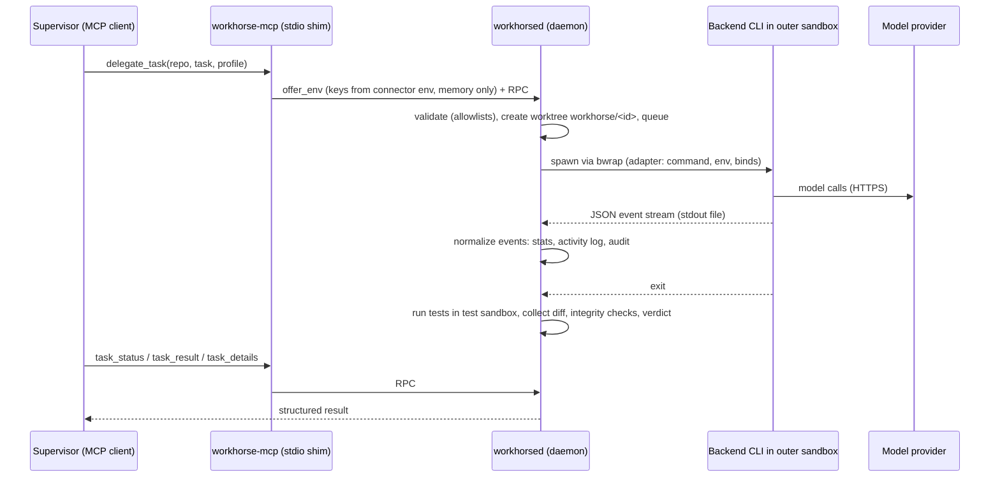

# Architecture



## Components

| Path | Role |
|---|---|
| `bin/workhorse-mcp` | Stateless stdio MCP server. It starts the supervisor/daemon on demand, forwards each tool call over the daemon's unix socket (mode 0600 inside a 0700 dir, plus a bearer token) and offers credentials from its own environment to the daemon (held in memory only). |
| `bin/workhorse-supervisor`, `bin/workhorsed` | Supervisor loop and daemon (JSON-RPC over HTTP on the unix socket). The daemon refuses to run as root. |
| `bin/workhorse` | Operator CLI: start/stop, health, repos, validate, check-provider, hello, backends, retention. |
| `lib/tasks.mjs` | Task manager: validation, queue and admission (per-provider concurrency, memory), run lifecycle, stall/timeout, retries and fallback chain, finalization (tests, diff, verdict, handoff), approval/handoff updates, recovery, retention. |
| `lib/handoff.mjs` | Deterministic handoff derivation (state, failed checks, owner, next action, resume hints) from a finished task. |
| `lib/sandbox.mjs` | Builds the outer bwrap argument list: hide paths, read-only and read-write binds, per-task mounts. |
| `lib/git.mjs` | Clones (allowlisted hosts only), worktrees, diffs, main-clone fingerprint. |
| `lib/config.mjs` | Config loading, defaults, auto-detection of backend binaries, bwrap and toolchain dirs. |
| `lib/credentials.mjs` | Optional JSON secret-store fallback. |
| `lib/audit.mjs` | Append-only JSONL audit log (values redacted). |
| `adapters/` | One adapter per coding-agent CLI plus the shared helpers; see [adapters.md](adapters.md). |
| `adapters/kilo/config/` | Kilo config shipped with the app: permissions, agents (`worker`, `review`, `explore`), guard plugin, worker contract (`AGENTS.md`), vendored skills. |

## Task lifecycle

`queued` → `running` → (`retry_wait` → `queued` …) → `testing` → `finalizing` → one terminal state:
`completed`, `failed`, `timeout`, `stalled`, `cancelled` or `interrupted`, or the parked state
`needs_approval` when the worker asked for a human decision (see below).

The verdict is computed by the daemon in this order of precedence:

1. `integrity_violation`: commits on the task branch, or the main clone changed
2. the terminal status, when it is not `completed` (`worker_error`, `timeout`, `stalled`, …)
3. `blocked`: the worker reported `status: blocked`
4. `no_changes`: implement mode with an empty diff
5. `success` / `tests_failed`, based on the daemon-run tests
6. `success_untested`: no test command was configured or detected

## Handoff and approval

Finalization also writes a **handoff record** (`task.handoff`, returned by `task_result`, summarized
in `task_status` and `list_tasks`): `state`, `failed_checks`, `owner`, `next_action`, `resume`,
`context`, `updated_at`/`updated_by`. It is derived from the verdict and the data above, never written
by the model, and it persists in `task.json`.

When the worker reports `needs_approval` / `needs_input` (or `blocked` with a request or after blocked
tool calls), the task is **parked** in status `needs_approval` with verdict `blocked`. No process
runs. `task_status` reports `terminal: true, parked: true`. Retention keeps the worktree, and
`approve_task` resumes the task through the `continue_task` path (approve), or closes it (reject).
`update_handoff` lets a supervisor or human change owner, next action, state and notes. Setting state
`needs_approval` / `needs_input` parks a finished task, and any other state unparks it.

```
completed/failed/... ──update_handoff state=needs_approval──▶ needs_approval ──approve_task approve──▶ queued (continue path)
         ▲                                                        │  └──approve_task reject──▶ cancelled (handoff closed)
         └────────────── update_handoff other state ──────────────┘
```

Details, field reference and the verdict-to-handoff table: [handoff.md](handoff.md).

## Data layout (`data_dir`)

```
repos/<name>/             main clones (workers see only their .git, read-only)
worktrees/<repo>/<id>/    one worktree per task (branch workhorse/<id>)
tasks/<id>/               task.json (incl. result + handoff), activity.log, run-N.events.jsonl, run-N.stderr.log, diff.patch, test.log
backend-data/<id>/        per-task agent data (session DB, snapshots, per-task settings)
kilo-home/, opencode-home/  backend HOMEs (config/code dirs root-owned after lock-config)
logs/                     daemon.log, audit.jsonl
run/                      socket, token, pid files (0700)
```

## Retries and fallback

When a run fails with retryable model API errors (HTTP 429/5xx, or `isRetryable`), the daemon puts
the provider on a cooldown and retries up to `retry.max_retries` times with back-off. After that it
tries the original profile's `fallback` list in order, each profile once. A fallback may use a
different backend. Sessions belong to a backend, so switching backends starts a fresh session in the
same worktree.
